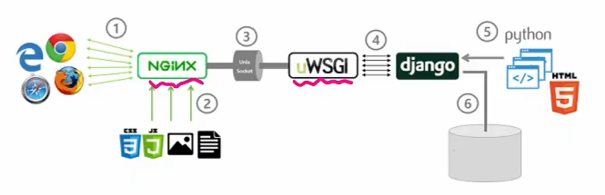

# 배포


## Django Project 배포



### AWS

- cloud9을 통해 EC2(클라우드 컴퓨터) 인스턴스에 접근


### NGINX

- 클라이언트의 요청을 받는 웹 서버
- root 주소로 오면 장고서버로 요청을 보내고 static으로 요청이 오면 staticfiles로 요청을 보낸다.


### uWSGI

- 장고와 NGINX 사이에 중개를 해주는 역할을 한다.


### DNS

- 도메인 등록


### Django settings

- `DEBUG = False` 


## Vue Project 배포


### Netlify

- vue project 파일을 모아서 배포할 수 있게 파일을 생성해준다.

```
$ npm run build
```


- build를 한 결과를 Netlify 사이트에서 배포

