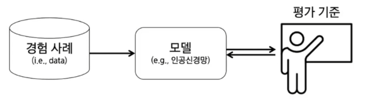
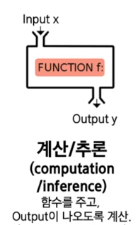
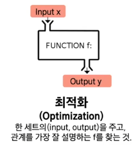
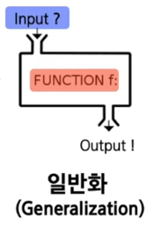

# Artificial Intelligence Basic

## 기계학습

### 기계학습의 구성 요소

- 경험 사례
- 모델
- 평가 기준

### 기계학습이란

- 계산/추론(computation/inference): 함수를 주고 output이 나오도록 계산

- 최적화(Optimization): 한 세트의 input, output을 주고 관계를 가장 잘 설명하는 모델(함수)를 찾는 것

- 일반화(Generalization): 학습 때 사용하지 않은 처음 주어지는 input에도 올바른 output이 나오게 하는 것

### Cost function

- 모델에 따라 데이터와 에측값(모델의 output)의 차이를 나타내는 함수
- cost function

$$
cost(W) = \frac{1}{m}\Sigma^m_{i=1}(Wx^i - y^i)^2
$$

### 모델 개선 방법(최적화)

- cost function이 최소가 되는 지점을 찾아 개선한다.
- Gradient 디렉션을 이용하여 최소가 되는 지점을 찾아 개선
- Gradient

$$
\nabla W = \frac{\partial cost}{\partial W} = \frac{2}{m}\Sigma^m_{i=1}(Wx^i - y^i)x^i
$$

- Learning rate와 Gradient로 W값을 변경한다

$$
W : = W - \alpha\nabla W
$$

- epoch: train dataset 전체를 한번 다 이용하면 1씩 상승

  - W값을 갱신할 때마다 dataset 전체를 다 이용하면 시간이 오래 걸리므로 mini batch 단위로 전체 train dataset을 나누어 사용하기도 한다

  - 업데이트 반복 횟수 = mini batch * epoch

### 학습 시 발생하는 문제

#### Underfitting

모델 선택을 잘 못 하여 실제 데이터에서는 잘 맞기 않는 현상, 모델이 너무 간단하여 학습 오류가 줄어들지 않는 현상

#### Overfitting

학습 데이터에 너무 잘 맞게 fitting이 되어 오히려 실제 데이터에서는 오류가 크게 나는 현상, 일반화가 잘 되지 않는 현상

### 해결 방법

- 충분히 많은 양의 데이터를 사용
- underfitting, overfitting에 따라 모델의 복잡도를 조정
- 가중치의 Regularization을 적용
- 드롭아웃(Drop out)

